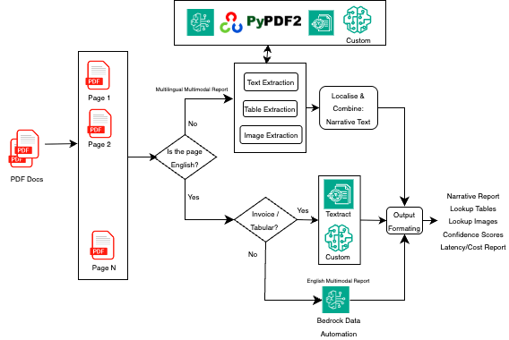

# Multi-lingual Document Processor (MDP)

[](https://aws.amazon.com/)
[](https://python.org)
[](https://docker.com)
[](LICENSE)

## 🌟 Overview

The Multi-lingual Document Processor (MDP) is a cloud-native solution that transforms complex multi-modal documents into structured, narrative text optimized for AI and RAG applications. Unlike traditional OCR tools, MDP excels at processing documents with varied layouts, multimedia elements, and non-Latin scripts. MDP localises multi-modal components on a page, extracts information from each component and then puts them together in a narrative form preserving content localisation. All images and tables are also saved in separate folders for all forms of downstream applications that need both structured and unstructured information. 

## 🚀 Key Features

### 🌍 **Multi-language Support**
- **Supported Languages**: English, Japanese, Korean
- **Coming Soon**: Thai, Hindi

### 📄 **Document Types**
- **Reports**: Multimedia documents with images, tables, charts
- **Invoices**: Tabular structure documents
- **Coming Soon**: Magazines, newspapers

### 🤖 **AI-Powered Processing**
- **Amazon Bedrock Integration**: Advanced LLM-based document analysis
- **Component Extraction**: Text, images, tables, charts, infographics
- **Narrative Generation**: Converts all elements to descriptive text for downstream RAG applications
- **Confidence Scoring**: Reliability assessment for extracted content

### 🏗️ **Architecture**
- **Serverless**: AWS Lambda + SageMaker Processing Jobs
- **Containerized**: Docker-based processing with ECR
- **API-First**: RESTful API with authentication
- **Scalable**: Auto-scaling based on demand

##  🎥 Video Demo


## 🏛️ System Architecture


### **Architecture Overview**

The Multi-lingual Document Processor follows a serverless architecture designed for scalability, reliability, and cost-effectiveness:

#### **🌐 Frontend Layer**
- **API Gateway**: RESTful API endpoint with API key authentication
- **Client Applications**: Python client (`mdp_client.py`) and direct API access
- **Authentication**: Secure API key-based access control

#### **⚡ Processing Layer**
- **Lambda Function**: Lightweight orchestrator that receives requests and manages workflow
- **SageMaker Processing Jobs**: Heavy-duty document processing in containerized environments
- **Docker Containers**: Custom-built images with all dependencies (stored in ECR)

#### **🤖 AI/ML Services**
- **Amazon Bedrock**: Advanced LLM services for document analysis and narrative generation
- **Amazon Textract**: OCR and table extraction for structured data
- **Custom AI Models**: Specialized processors for different document types and languages

#### **💾 Storage & Data**
- **S3 Buckets**: 
  - Input documents storage (`uploads/`, `invoices/`, etc.)
  - Output results storage (`output/`)
  - Lambda deployment packages and layers
- **ECR Repository**: Docker image storage and versioning

#### **🔧 Infrastructure**
- **CloudFormation**: Infrastructure as Code for reproducible deployments
- **IAM Roles**: Secure, least-privilege access between services
- **CloudWatch**: Logging and monitoring for all components

### **🔄 Processing Flow**

The picture below illustrates the processing workflow. 



1. **📤 Document Upload**: Users upload PDF documents to S3 bucket folders
2. **🚀 API Request**: Client submits processing request via API Gateway
3. **⚡ Lambda Orchestration**: Lambda function validates request and initiates SageMaker job
4. **🐳 Container Processing**: SageMaker spins up Docker container with processing logic
5. **🤖 AI Analysis**: Container uses Bedrock, Textract, CV algorithms and custom algorithms for document analysis
6. **📝 Content Generation**: AI generates narrative descriptions of all document components
7. **💾 Output Storage**: Results saved to S3 in structured format
8. **✅ Completion**: Client receives confirmation and can access processed results

### **🔒 Security Features**
- **API Authentication**: API key-based access control
- **IAM Roles**: Service-to-service authentication with minimal permissions
- **VPC Support**: Optional network isolation for enhanced security
- **Encryption**: Data encrypted at rest (S3, ECR) and in transit (HTTPS)

### **📈 Scalability & Performance**
- **Auto-scaling**: SageMaker automatically scales based on demand
- **Concurrent Processing**: Multiple documents can be processed simultaneously
- **Resource Optimization**: Pay-per-use model with automatic resource management
- **Global Deployment**: Can be deployed in any AWS region supporting required services

## 📊 Input / Output Structure

### ✅ **Input Structure**

#### **S3 Bucket Organization**
```
s3://your-bucket-name/
├── japanese-reports/          # 📁 Input documents folder
│   ├── document1.pdf          # Individual PDF files
│   ├── document2.pdf          # Other PDF files 
├── english-invoices/          # 📁 invoice folder
│   ├── invoice_001.pdf
│   └── invoice_002.pdf
└── english-reports/           # 📁 folder
    ├── annual_report.pdf
    └── quarterly_report.pdf
```

#### **Document Requirements**
- **Format**: PDF files only (`.pdf` extension)
- **Size Limits**: 
  - Recommended: < 50MB per file
  - Maximum: 100MB per file
  - Pages: Up to 50 pages per document
- **Content Types**: Text, images, tables, charts, infographics
- **Quality**: Minimum 150 DPI for optimal OCR results

#### **Supported Document Categories**
| Category | Description | Optimization |
|----------|-------------|-------------|
| `report` | Multimedia documents with mixed content | General-purpose processing |
| `invoice` | Tabular documents with structured data | Table extraction focused |
| `magazine` | Magazine-style layouts (Coming Soon) | Layout-aware processing |
| `newspaper` | Newspaper formats (Coming Soon) | Column-aware processing |

#### **Language Support**
| Language | Code | Status | Script Type |
|----------|------|--------|-------------|
| English | `english` | ✅ Production | Latin |
| Japanese | `japanese` | ✅ Production | Hiragana, Katakana, Kanji |
| Korean | `korean` | ✅ Production | Hangul |
| Thai | `thai` | 🔄 Coming Soon | Thai script |
| Hindi | `hindi` | 🔄 Coming Soon | Devanagari |

#### **API Request Format**
```json
{
  "file_key": "uploads",              // S3 folder path (required)
  "bucket": "your-bucket-name",       // S3 bucket name (required)
  "doc_category": "report",           // Document category (required)
  "doc_language": "japanese",         // Source language (required)
  "output_language": "english"        // Target language (required)
}
```

#### **Client Usage Examples**
```bash
# Process Japanese reports in uploads folder
python mdp_client.py --stack-name your-stack \
  --folder uploads \
  --language japanese \
  --category report \
  --output-language english

# Process Korean invoices in specific folder
python mdp_client.py --stack-name your-stack \
  --folder invoices/korean \
  --language korean \
  --category invoice \
  --output-language english

# Process only PDF files with specific extensions
python mdp_client.py --stack-name your-stack \
  --folder documents \
  --extensions pdf \
  --language english
```

#### **Input Validation**
The system automatically validates:
- ✅ File format (PDF only)
- ✅ File accessibility in S3
- ✅ Language code validity
- ✅ Category support
- ✅ File size limits
- ⚠️ Content quality (warns if low resolution)

#### **Best Practices for Input**
1. **File Organization**: Group similar documents in folders by category
2. **Naming Convention**: Use descriptive filenames (e.g., `invoice_2024_001.pdf`)
3. **Quality**: Ensure documents are clear and readable
4. **Size**: Keep files under 50MB for optimal processing speed
5. **Language Consistency**: Process documents of the same language together

### 📁 **Output Structure**
```
s3://bucket/output/document-name/
├── final_report.txt           # 📄 Complete narrative description
├── processing_report.json     # 📋 Processing metadata
├── images/                    # 🖼️  Extracted images
│   ├── image_page_1_1.png
│   └── image_page_2_1.png
└── tables/                    # 📊 Extracted tables
    ├── table_page_5_1.csv
    └── table_page_6_1.csv
```

## 🚀 Things to watch out for

- MDP does not classify documents by their category and hence when providing documents for processing seperate out documents by their document type (report or invoice) into separate folders under the S3 bucket created after you deploy the stack
- Note that the deployment stack creates an S3 bucket first to store all artifacts for the CDK deployment. All your data needs to go directly under a new folder (any name) in this S3 bucket. The folder name needs to be provided as part of the payload when calling the solution. Create separate folders for different document categories.
- MDP version 1.0 can be deployed in regions that have BDA, although use of BDA is just a part of it to handle english reports. So update the `deploy_dynamic.sh` with the right region. Also please ensure Clause 3.7 Sonnet is accessible in your account wherever it is available. (Regions were BDA is available: `us-east-1`, `us-west-2`, `us-gov-west-1`, `eu-central-1`, `eu-west-1`, `eu-west-2`, `ap-south-1`, `ap-southeast-2`)
- If you already have a stack deployed in an AWS region, delete the stack first before deploying another stack as this may cause some role creation clashes and the new stack may throw some errors.
- If you wish to modify the code and build your own custom image, just modify the code in the `src` folder, delete the `images` folder and then run `./build_sagemaker_prebuilt.sh`. This will re-build the docker image in the `images` folder.

## ⚡ Quick Start (5 Minutes)

### Prerequisites
- AWS CLI configured with appropriate permissions
- Docker running
- Python 3.10+

### 0. Check for prerequisites
```bash
aws sts get-caller-identity

docker info >/dev/null 2>&1 && echo "Docker is running" || echo "Docker is not running"
```

### 1. Deploy the Stack
```bash
git clone <repository-url>
cd multi-lingual-document-processor
chmod +x build_sagemaker_prebuilt.sh && ./build_sagemaker_prebuilt.sh
chmod +x deploy_dynamic.sh && ./deploy_dynamic.sh

# Record YOUR-STACK-NAME and YOUR-BUCKET-NAME as environment variables
```

### 2. Upload Test Document
```bash
# Use the bucket name from deployment output
aws s3 cp samples/<your filename>.pdf s3://YOUR-BUCKET-NAME/<uploads folder>/
```

### 3. Process Document
```bash
# Use the stack name from deployment output
python mdp_client.py --stack-name YOUR-STACK-NAME \
  --folder uploads \
  --language japanese \
  --category report \
  --output-language japanese
```

### 4. Check Results
```bash
# Monitor processing
python mdp_client.py --stack-name YOUR-STACK-NAME --check-status

# View output files
aws s3 ls s3://YOUR-BUCKET-NAME/output/ --recursive
```

### 5. Cleaning Up
```bash
# List all MDP stacks
./cleanup_stack.sh --list-stacks
# Clean up a specific stack (with confirmation) 
./cleanup_stack.sh mdp-stack-user-abc123 
# Force cleanup without prompts 
./cleanup_stack.sh mdp-stack-user-abc123 --force 
# Clean up in different region 
./cleanup_stack.sh mdp-stack-user-abc123 --region us-west-2 
# Show help 
./cleanup_stack.sh --help
```

## 🛠️ Deployment Details

### **Automated Deployment**
The `deploy_dynamic.sh` script handles everything:
- ✅ **Resource Creation**: S3 bucket, ECR repository, unique naming
- ✅ **Docker Build**: Platform-specific image building (ARM64/AMD64)
- ✅ **Image Push**: Automated ECR push with authentication
- ✅ **Infrastructure**: CloudFormation stack with all AWS resources
- ✅ **Validation**: Template validation and deployment verification

### **Generated Resources**
```
Stack Name:     mdp-stack-{user}-{random}
S3 Bucket:      mdp-bucket-{user}-{random}
ECR Repository: mdp-processor-{user}-{random}
API Gateway:    https://{id}.execute-api.us-east-1.amazonaws.com/prod/process
Lambda Function: {stack-name}-MDPDocumentProcessor
```

### **AWS Services Used**
- **Lambda**: Document processing orchestration
- **SageMaker**: Heavy processing jobs in containers
- **S3**: Document storage and output
- **ECR**: Docker image registry
- **API Gateway**: RESTful API with authentication
- **Bedrock**: AI/ML document analysis
- **CloudFormation**: Infrastructure as Code

## 📋 Usage Examples

### **Process Japanese Invoice**
```bash
python mdp_client.py --stack-name mdp-stack-user-abc123 \
  --process-folder invoices \
  --language japanese \
  --output-language english \
  --category invoice
```

### **Process Korean Report**
```bash
python mdp_client.py --stack-name mdp-stack-user-abc123 \
  --process-folder documents \
  --language korean \
  --output-language english \
  --category report
```

### **List Files in Bucket**
```bash
python mdp_client.py --stack-name mdp-stack-user-abc123 --list-folder uploads
```

### **Check Processing Status**
```bash
python mdp_client.py --stack-name mdp-stack-user-abc123 --check-status
```

## 🔍 Monitoring & Troubleshooting

### **Check Processing Jobs**
```bash
# List recent SageMaker jobs
aws sagemaker list-processing-jobs --sort-by CreationTime --sort-order Descending --max-items 5

# Get job details
aws sagemaker describe-processing-job --processing-job-name JOB-NAME
```

### **View Logs**
```bash
# Lambda logs
aws logs describe-log-streams --log-group-name "/aws/lambda/STACK-NAME-MDPDocumentProcessor"

# SageMaker logs
aws logs filter-log-events --log-group-name "/aws/sagemaker/ProcessingJobs" --log-stream-name-prefix "JOB-NAME"
```

### **Common Issues**
| Issue | Solution |
|-------|----------|
| Docker build fails | Use `Dockerfile.sagemaker` (most reliable) |
| Processing timeout | Check document size (< 50MB recommended) |
| No output files | Verify input files exist in S3 |
| API authentication | Check API key in CloudFormation outputs |

## 📁 Project Structure

```
multi-lingual-document-processor/
├── 📄 README.md                    # This comprehensive guide
├── 🚀 deploy_dynamic.sh            # ⭐ Main deployment script
├── 🐳 Dockerfile.sagemaker         # ⭐ Production Docker image
├── 🐳 Dockerfile.arm64             # ARM64 optimized image
├── 🔧 mdp_client.py                # ⭐ Python client for API
├── ⚙️  lambda_function.py           # Lambda entry point
├── 🔄 processing_script_clean.py   # Main processing logic
├── 📋 CFT_template_dynamic.yml     # CloudFormation template
├── 📋 buildspec.yml                # CodeBuild specification
├── 📋 requirements.txt             # Python dependencies
├── 📋 stack_config.json            # Configuration file
├── 🔧 load_prebuilt_image.sh       # Load pre-built Docker images
├── 🖼️  MDP_2.png                   # Architecture diagram
├── 📄 LICENSE                      # MIT License
├── 📁 src/                         # ⭐ Source code modules
│   ├── config/                     # Configuration management
│   │   ├── config.py               # Main configuration
│   │   └── prompts.py              # AI prompts
│   ├── processors/                 # Document processors
│   │   ├── document_processor.py   # Main document processor
│   │   ├── image_processor.py      # Image analysis
│   │   ├── table_processor.py      # Table extraction
│   │   ├── text_processor.py       # Text processing
│   │   └── [other processors]      # Specialized processors
│   └── utils/                      # Utility functions
│       ├── cleanup_utility.py      # Cleanup tools
│       ├── directory_manager.py    # File management
│       └── postprocessing.py       # Output processing
├── 📁 Layers/                      # ⭐ Lambda layers (dependencies)
│   ├── SM_layer_new-*.zip          # SageMaker layer
│   ├── pandas_layer_new-*.zip      # Pandas layer
│   ├── numpy_layer_new-*.zip       # NumPy layer
│   ├── pydantic_layer-*.zip        # Pydantic layer
│   └── rpds_layer_new-*.zip        # RPDS layer
├── 📁 samples/                     # ⭐ Test documents
│   └── Japanese_doc_shorter_images.pdf
├── 📁 images/                      # Pre-built Docker images
    ├── mdp-sagemaker_latest_sagemaker_amd64.tar.gz
    └── README.md                   # Usage instructions
```

### ⭐ **Key Files for Users**
- **`deploy_dynamic.sh`** - One-command deployment
- **`mdp_client.py`** - Easy-to-use Python client
- **`Dockerfile.sagemaker`** - Production-ready container
- **`src/`** - All processing logic and configuration
- **`Layers/`** - Pre-built dependencies for Lambda
- **`samples/`** - Test documents to verify deployment

## 🔧 Advanced Configuration

### **Custom Processing Parameters**
Edit `src/config/config.py`:
```python
# Model settings
BEDROCK_MODEL = "claude-3-7-sonnet-20250219-v1:0"
PROCESSING_TIMEOUT = 900  # seconds
MEMORY_SIZE = 1024        # MB

# Language-specific settings
LANGUAGE_MODELS = {
    "japanese": "claude-3-sonnet",
    "korean": "claude-3-sonnet",
    "english": "claude-3-haiku"
}
```

### **Custom Prompts**
Edit `src/config/prompts.py`:
```python
# Document analysis prompts
DOCUMENT_ANALYSIS_PROMPT = """
Analyze this document and provide a detailed narrative...
"""

# Table extraction prompts
TABLE_EXTRACTION_PROMPT = """
Extract and describe the tabular data...
"""
```

## 🧪 API Reference

### **Submit Processing Job**
```bash
curl -X POST https://API-ENDPOINT/prod/process \
  -H "Content-Type: application/json" \
  -H "x-api-key: YOUR-API-KEY" \
  -d '{
    "file_key": "uploads",
    "bucket": "your-bucket-name",
    "doc_category": "report",
    "doc_language": "japanese",
    "output_language": "english"
  }'
```

### **Response**
```json
{
  "message": "Document processing request accepted",
  "requestId": "12345-abcde-67890"
}
```

## 🔒 Security & Permissions

### **Required AWS Permissions**
- **S3**: Full access for bucket operations
- **Lambda**: Function creation and execution
- **SageMaker**: Processing job execution
- **ECR**: Repository and image management
- **API Gateway**: API creation and management
- **CloudFormation**: Stack operations
- **IAM**: Role and policy management
- **Bedrock**: Model access and data automation

### **Security Features**
- **API Key Authentication**: Secure API access
- **IAM Role-based Access**: Least privilege principle
- **VPC Support**: Network isolation (optional)
- **Encryption**: S3 and ECR encryption at rest


## 🤝 Contributing

1. Fork the repository
2. Create a feature branch
3. Make your changes
4. Test with sample documents
5. Submit a pull request

## 📄 License

This project is licensed under the MIT License - see the [LICENSE](LICENSE) file for details.

## 🆘 Support

- **Documentation**: Check this README and inline code comments
- **Issues**: Create GitHub issues for bugs or feature requests
- **Logs**: Always check CloudWatch logs for troubleshooting
- **AWS Support**: Use AWS Support for service-specific issues

## 🎯 Roadmap

### **Current Version (v1.0)**
- ✅ Japanese, Korean, English support
- ✅ Report and invoice processing
- ✅ Automated deployment
- ✅ API Gateway integration

### **Upcoming Features**
- 🔄 Thai and Hindi language support
- 🔄 Magazine and newspaper document types
- 🔄 Batch processing capabilities
- 🔄 Real-time processing API
- 🔄 Web UI for document upload
- 🔄 Advanced analytics dashboard

## Core Contributors

- Sujoy Roy (Principal Applied Scientist, AWS)
- Shreya Goyal (Applied Scientist, AWS)
- Xiaogang Wang (Senior Applied Scientist, AWS)
- Iman Abbasnejad (Deep Learning Architect, AWS)
---

**🚀 Ready to process your multi-lingual documents? Start with the Quick Start guide above!**